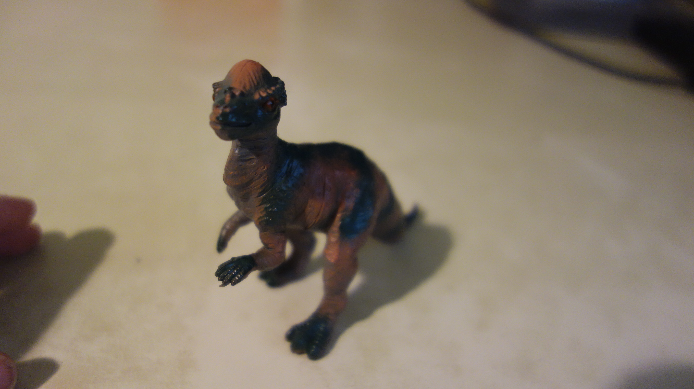
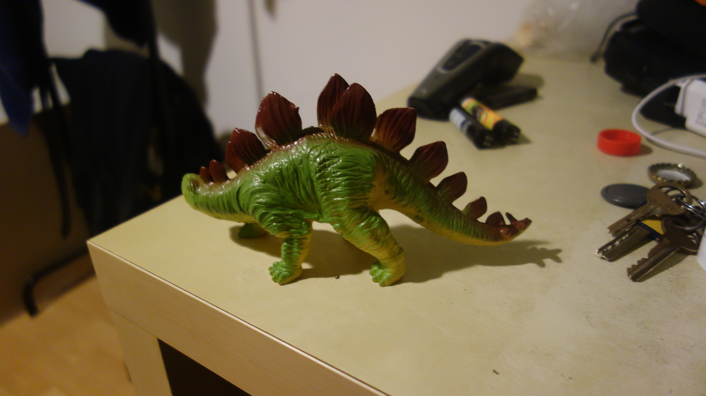
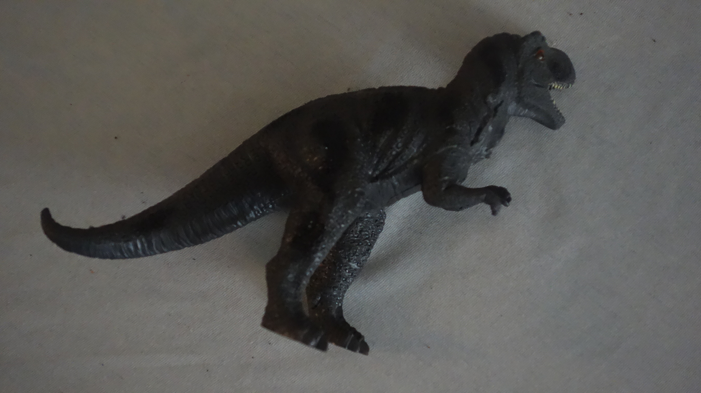
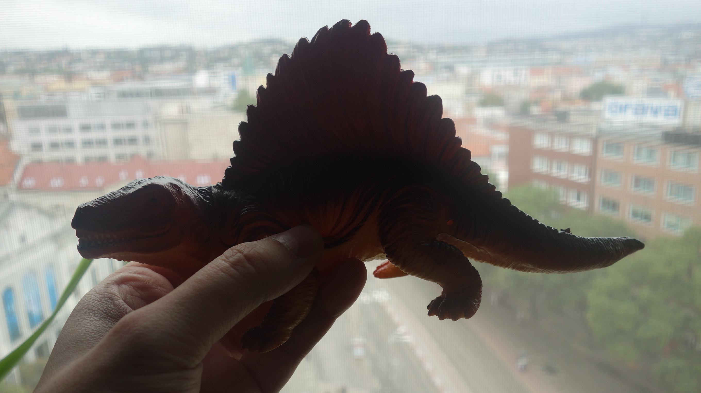
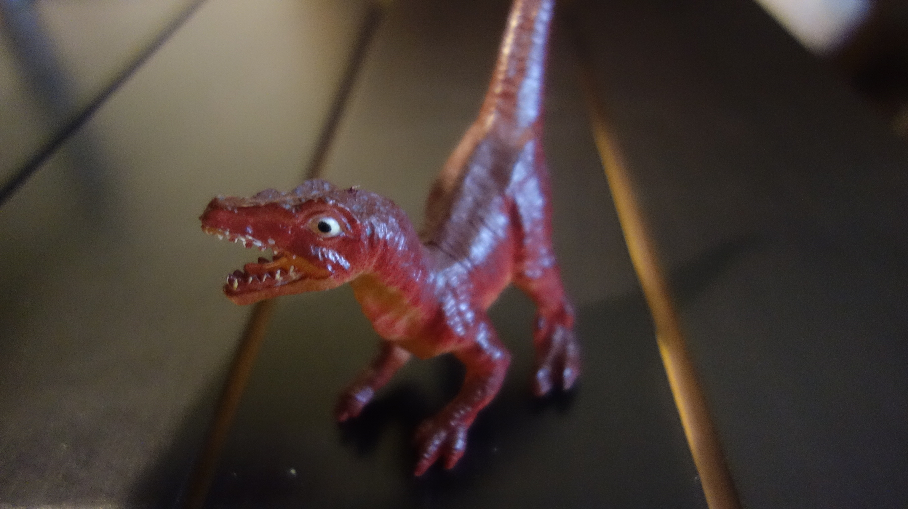

# DINO API COMPUTER VISION PROJECT

There are 5 classes of plastic dinosaurus and 4 API endpoints for image classification,detection,segmentation,generation.
For training models I used 2273 images.

For image classification I used my custom CNN architecture.
For detection and segmentation  I used pretrianed YOLOv8 model with pretrained weights.(https://docs.ultralytics.com/)
For Generation of images I used proGAN architecture(https://arxiv.org/abs/1710.10196)

I deployed this project on https://dino-5hku.onrender.com.

